# 准备

1. 风格参照：

大哥，我有比较严重的选择困难症，在这个sample网站上花了很多很多时间去找，但还是感觉“差一点”。但我相信你的审美，所以我打算给你几个bullet points，你看这样能不能work out:&#x20;

-清晰，让人一眼就能看懂。我觉得在clarity中做的最好的就是苹果：https://www.apple.com/mac/

-有趣，比如我签的机构这个网站我就觉得很有趣 https://stoooges.com/web/

但其实，和你网站的风格差不多就行，然后色调可以稍微暗一点，因为我的核心是在新疆做的足球青训，而这个事情有一点点沉重。

* 特殊需求：

2.1 按钮点击栏这里，麻烦把足球青训的icon做最大（至少比其它icons大一倍）。因此您这种长方形估计不太好做，您看看怎么work out。

2.2 大哥，我的Youth Soccer Project界面是按照时间顺序讲述我做足球青训相关事情的故事。先是校内的联赛，再到社区的冬令营，再到全国范围的老虎足球青训计划，以及中间的球队实习。你看看你能不能，比如用一条线或者别的设计，把它们从上至下贯穿一下，观感上一下就能明白这是一条时间线。

# 主页

主页我想这样整大哥：
第一眼看到的页面，模块一，我想以一个动态视频为背景，然后上面放我的名字和short bio

往下滑，到第二个模块，我想右边放我的个人照片，然后左边放about me

再往下滑，第三个模块，就是按钮点击栏，像你的那样

第四个模块，Personal Interests, 4个icons，每个icon下面配上一句话

最后就是底下个人信息什么的

1. 姓名：

**Thomas Huang**

* 第一模块背景视频：

[89\_1730197835(Video in Original Quality).mp4](<files/89_1730197835(Video in Original Quality).mp4>)

* Short Bio：

Building pathways through soccer— Founder, The Tiger Project · TEDx Organizer\&Speaker ·**&#x20;**&#x53;cholar · Musical Performer

* 个人照片

大哥 我这里放了两张 你帮我选一张吧～

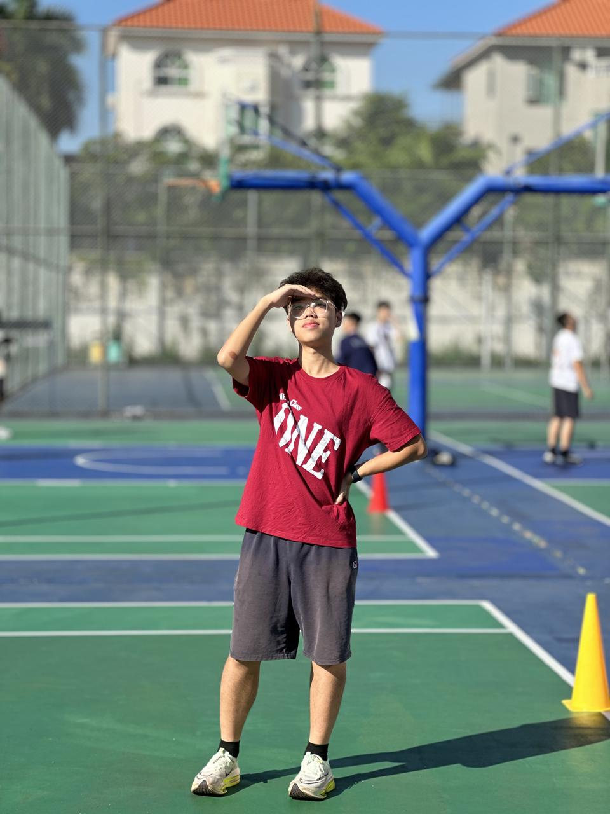

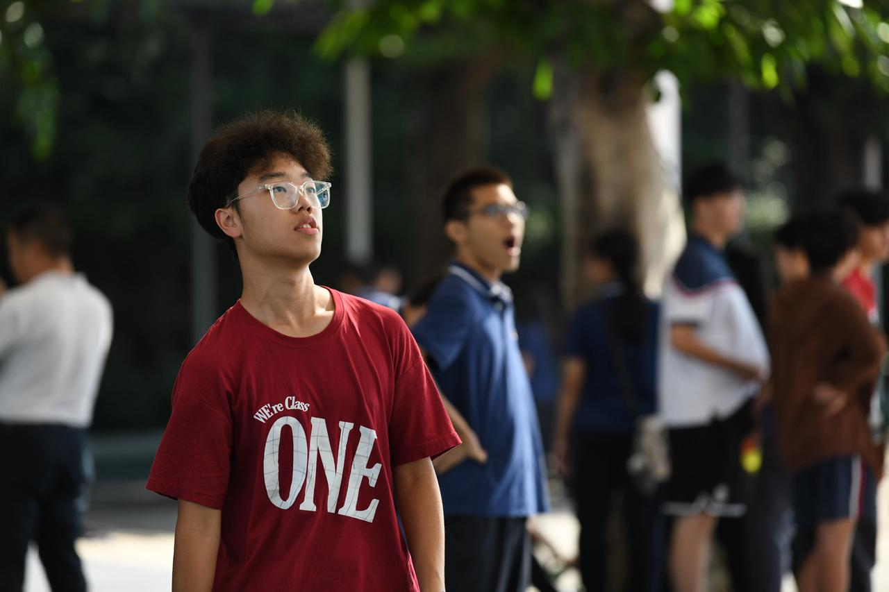

* About简介：

（区别于Short Bio，这里使用的都是完整的句子，建议讲清楚Mission，Vision，Values）

Since I was a kid, I’ve wondered what my headstone might say; after all, it is one of the few physical records of a life.

I hope, perhaps on a holographic headstone, it will read:

A clear-eyed thinker; a giver at heart.

A hands-on doer; a free and fearless spark.

A playful soul; a patient educator.

A north-star goal; a determined change maker.

* 按钮/点击烂：

（这里就是最能够代表您的几个identity的名称，每个identity将出现在一个按钮上，也是点击按钮后新界面的主题，建议2-4个按钮，如：Entrepreneur，Scholar，Educator，Magician。注意：不是一定需要4个界面）

-Youth Soccer Project

-Other Initiatives & Programs

-Research & Competitions

-Public Speaking

（Youth Soccer Project做成最大～至少比其它的大一倍）

* Personal Interests：

4个图标，每个图标底下配一句话

Soccer

Since 2015, I’ve been part of the Bayern family—countless late nights and friendships made along the way.

Jazz

Louis Armstrong was my gateway to jazz—his voice has brought joy to so many and carried me through the tough times.

Musical

I see myself in Hamilton’s story—and I hope to be that kind of person.

Travel

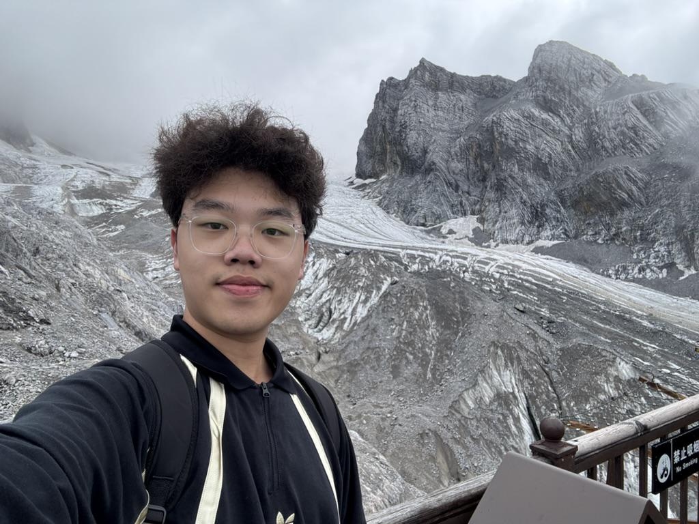

I’ve traveled to 20+ countries—always excited for the unknowns of the road.

* Contact联系方式：

thomashuang0708@gmail.com/ 1985135874@qq.com

+86 13923278031

Wechat: Thomas13923278031 (这个就先放上吧

* 个人LOGO：

（可用ai生成，推荐[这个网站](https://openart.ai/home?utm_source=google\&utm_medium=pmax\&utm_campaign=Performance_Max_Sci_Fi_Fantasy_TV_Fans\&utm_source=google\&utm_medium=pmax\&utm_campaign=21329235028\&utm_term=\&gad_source=1\&gclid=CjwKCAiAw5W-BhAhEiwApv4goG6cY2gRt64N9vAodAQHgSaxWNNAFONdarbmTmoAAae1pWiKs4RHVhoC0dMQAvD_BwE)）

# 界面一 Youth Soccer Project

这是背景图片，然后除了Youth Soccer Project这个标题之外麻烦帮我配一句话～

From a school **soccer league** to a community **winter camp** to **The Tiger Project**, I connect underprivileged, talented kids to professional clubs, providing them with a life-changing opportunity.

As of August 2025, **19** kids earned trials; **8** were signed.&#x20;
这两句的大小可以不一样大哥，按你的审美就行

## 1. 活动/项目名称：May, 2023 : Xingyue Soccer League

### a. 文字描述：

1. At the start of Grade 10, I launched the region’s **1st soccer league**; it now has **100+ players** and has completed **three seasons**.

2. We have a dedicated photo\&media team—after every match, we publish reports and highlights on our channel.

3. I also served as the live commentator—one of my childhood dream jobs.

### b. 相关媒体呈现：

（可以是图片/视频/超链接报道/录音/PDF展示....)

1. 对应第一句话

* 对应第二句话

* 对应第三句话

* logo（放哪儿都行

### c. 媒体呈现需求：

一一对应，同时呈现

## 2. 活动/项目名称：February, 2024: Commmunity Soccer Camp

### a. 文字描述：

Later on, I led my team to invite **over 50 kids** from the community and ran a free, week-long winter camp by working with local youth soccer academy.&#x20;

### b. 相关媒体呈现：

### c. 媒体呈现需求：

滚动呈现

## 3. 活动/项目名称：The Tiger Project: connecting underprivileged, talented kids to professional soccer trials

大哥，麻烦在最前面加两个个按钮
一、“Visit Our Official Website”，然后跳转项目网站（也是找offer studio做的，但现在应该还没做出来，可以先随便跳转一个网站，后期替换）。

二、“Visit Our Youtube Channel”, 跳转：https://www.youtube.com/@TheTigerProject

### a. 文字描述：（因为这项目太多东西了，所以我就按照时间顺序一条一条写了

1. In March 2024, I posted my idea on social media and soon built the initial team with 10+ international high school students from across China.

* In July 2024, I reached out **via social media&#x20;**&#x74;o one of the largest soccer academies in China and got the chance to negotiate with the leaders in person.

* In October 2024, I saw a video about a desert school team that won second place nationwide. I left a comment and connected with the blogger and the school.

* In November 2024, I **offcially launched the Tiger Project** and led 12 teammates on a **2,000 km** trip to Arel Primary School in Xinjiang, where we met the kids and learned about their **struggles and needs**.

* During that week, I contacted the biggest local company, pitched a PPT to the owner, and secured long-term support. I also reached out to a foundation and got **200,000 RMB&#x20;**&#x74;o build a soccer field.&#x20;

(I broke my leg before the trip😂)大哥可以把这句加上

* I persuaded the local government to build **a new pitch** for Arel Primary School.

* In January 2025, I brought **7 kids&#x20;**&#x74;o Guangzhou for pro club trials—**6 of them were selected**, forever changing their lives.

* Impressed by my passion and ability, the owner of the club that our project worked with **hired me as the press officer and his assistant**, traveling with the team for two weeks to compete in **China Champions League**.

[DJI\_20250330\_31236\_197 PM\_video.MP4](files/DJI_20250330_31236_197 PM_video.MP4)

* Back in The Tiger Project, our team expanded to **40+ members** from **15+ cities** worldwide.

* I presented the project on stages like **TEDx and CTB**, and we started receiving **livestream** and **speaking** invitations.

* In August 2025, I took **12 more kids** to a pro club trial in Urumqi—**3 of them were selected.**

* I am now leading my team to prepare for the next trials in **Sichuan and Guizhou province**, giving kids there the same opportunity.

### c. 媒体呈现需求：

-每一句文字底下或旁边放照片就行。对应上就行。图片如果不多的话就一次呈现完，如果一次呈现放不下的话，再做成滚动。

-另外屏幕最左边或别的地方看看能不能加一个时间轴。

-加粗的词请保持加粗

-最后在最底下再加一个Visit Our Website的icon

# 界面二 **Research & Competitions**

## 1. 活动/项目名称：Certificates & Awards

### a. 相关媒体呈现：

### b. 媒体呈现需求：

-麻烦帮我做成双/三排的滚动～

-滚动的稍微快一些，每个certificate可以小一点～

## 2. 活动/项目名称：Yuanpei Young Scholar: Youth Soccer & Social Mobility Research in Xinjiang

### a. 文字描述：

Drawing on **Bourdieu’s capital framework**, this study **proposes a model** explaining how youth soccer shapes the social mobility of Xinjiang adolescents.

### b. 相关媒体呈现：

[足球社会学论文.pdf](files/足球社会学论文.pdf)

## 3. 活动/项目名称：Writing Sample: John Loke Writing Competition&#x20;

（如有名字比如：OFFER STUDIO，只写这个就可以，具体是干什么的写在文字描述部分）

### b. 相关媒体呈现：

[Xuanlin-Huang-Economics-1.pdf](files/Xuanlin-Huang-Economics-1.pdf)

## 4. 活动/项目名称：China Think Big Competition

### b. 相关媒体呈现：

[CTB 老虎足球青训小组 01.pdf](<files/CTB 老虎足球青训小组 01.pdf>)

# 界面三 Other Initiatives & Programs

导语：Beyond youth soccer development, my interests branched into the humanities and venture-building. Here are a few projects that show the other sides of me.

## 1. 活动/项目名称：Sociology Day

### a. 文字描述：

I launched our school’s first **Sociology Day** to promote a humanistic spirit on campus—**500+** students participated.

### b. 相关媒体呈现：因为这个事情还没做，所以就先放下面这8张照片，后期替换

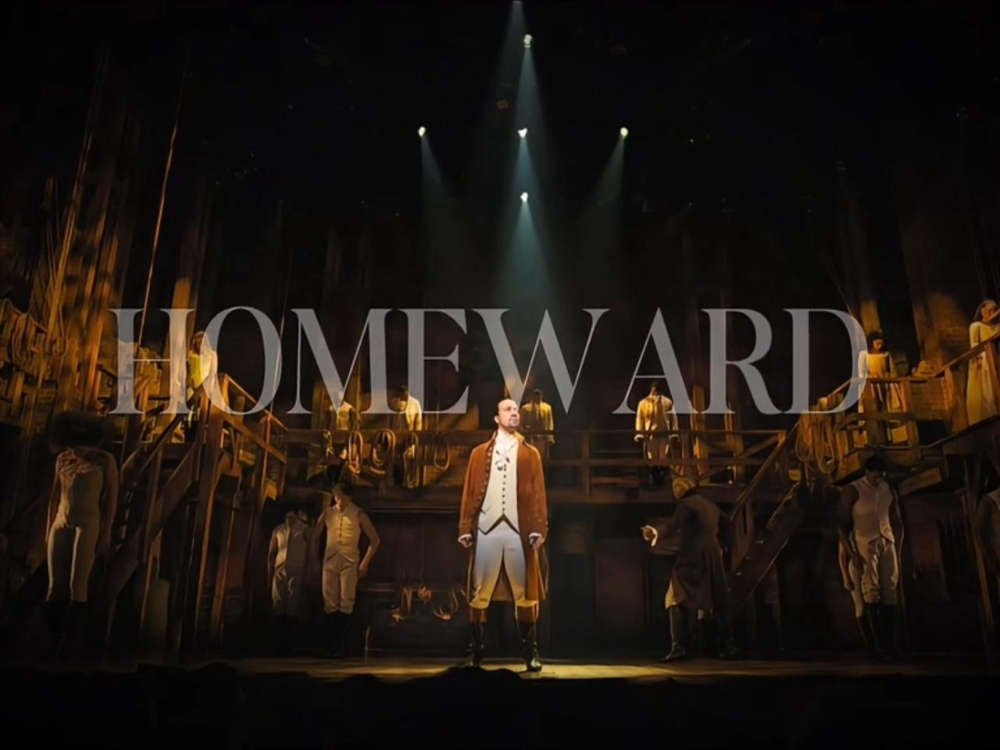

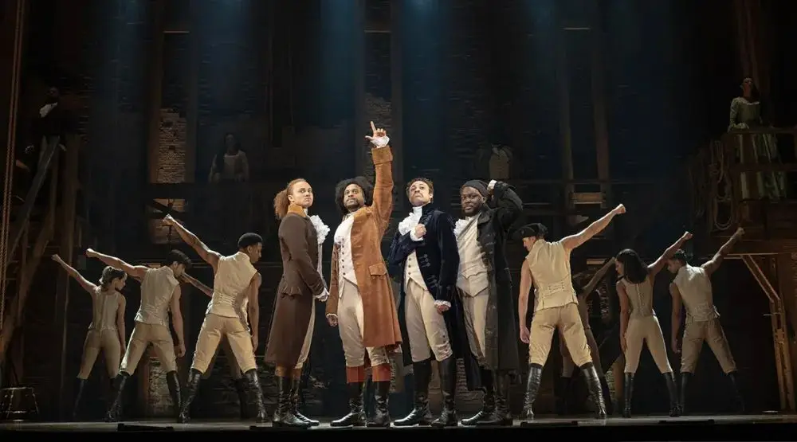

### c. 媒体呈现需求：

4张一排，一共两排。同时呈现。

## 2. 活动/项目名称：LaunchX 2024

### a. 文字描述：

At LaunchX 2024, I co-founded **Ad-Mentor**, an AI assistant for microbusinesses to produce ready-to-post social ads.

### b. 相关媒体呈现：

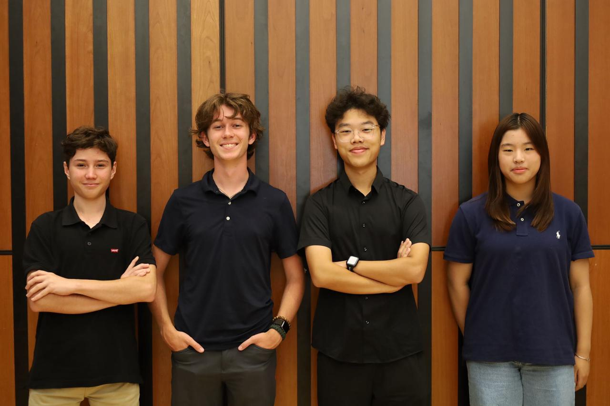

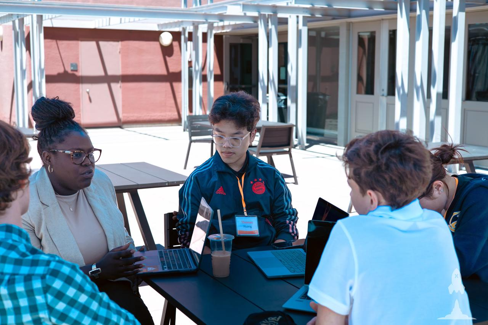

[demo day image generation.mp4](<files/demo day image generation.mp4>)

Our Product

### c. 媒体呈现需求：

同时呈现

## 3. 活动/项目名称：GCGS Entrepreneurship Club

### a. 文字描述：

I founded the **Entrepreneurship Club** at the start of Grade 9 to chase a childhood startup dream. We built products, hosted a launch event, opened our online store, and ran a campus Shark Tank and scavenger hunts.

### b. 相关媒体呈现：

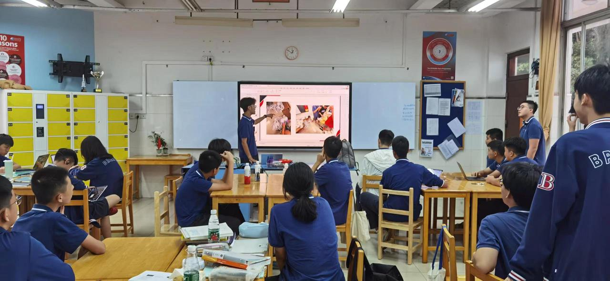

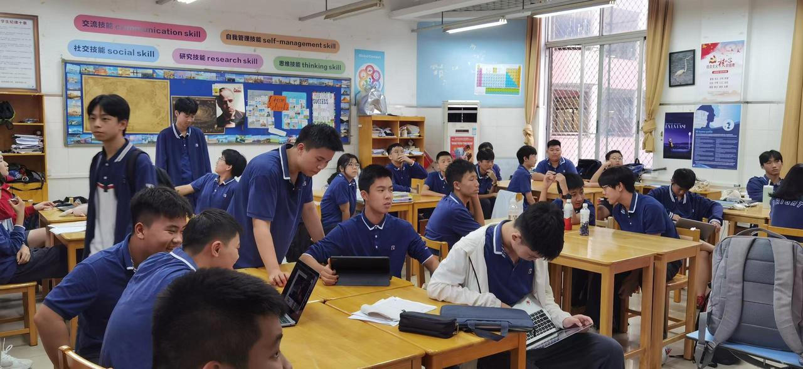

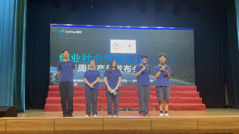

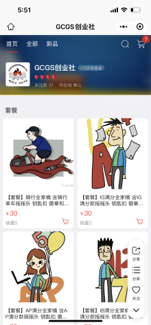

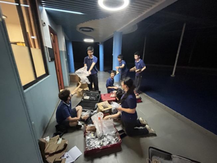

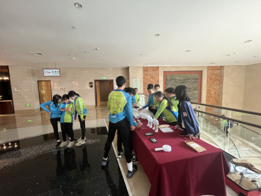

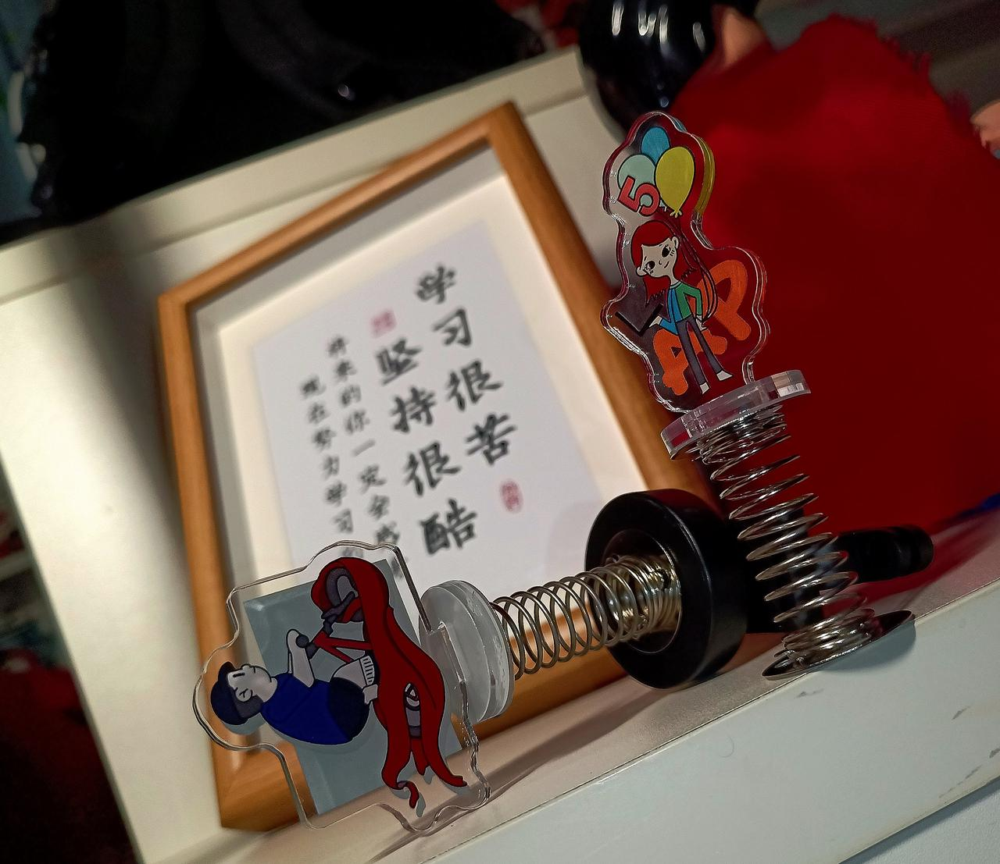

### c. 媒体呈现需求：

同时展现吧，你看看。

## 4. 活动/项目名称：Wharton Sports Business Academy

### b. 相关媒体呈现：

[Group 10 Presentation - National Lacrosse League.pdf](<files/Group 10 Presentation - National Lacrosse League.pdf>)

# 界面四 Public Speaking

I grew up wanting to be a great speaker and one day step onto the TED stage. Language, to me, carries power.

## 1. 活动/项目名称：TEDxGCGS 2024

### a. 文字描述：

I organized **TEDxGCGS 2024**, inviting five speakers to explore what “**change**” means today. **500+** people attended, and I served as the host for the event.

### b. 相关媒体呈现：

（可以是图片/视频/超链接报道/录音/PDF展示....)

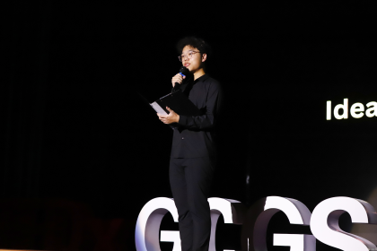

### c. 媒体呈现需求：

同时呈现

## 2. 活动/项目名称：TEDxGCGS 2025

### a. 文字描述：

At TEDx 2025, I delivered a talk on how soccer influences the lives and future pathways of Xinjiang’s youth.

### b. 相关媒体呈现：

### c. 媒体呈现需求：

同时呈现

## 3. 活动/项目名称：Public Speaking Competitions

### a. 文字描述：

WSDA-Original Oratory: Regional Champion & 9th in National Finals

e-china: Natioanl Finalist

### b. 相关媒体呈现：

WSDA:

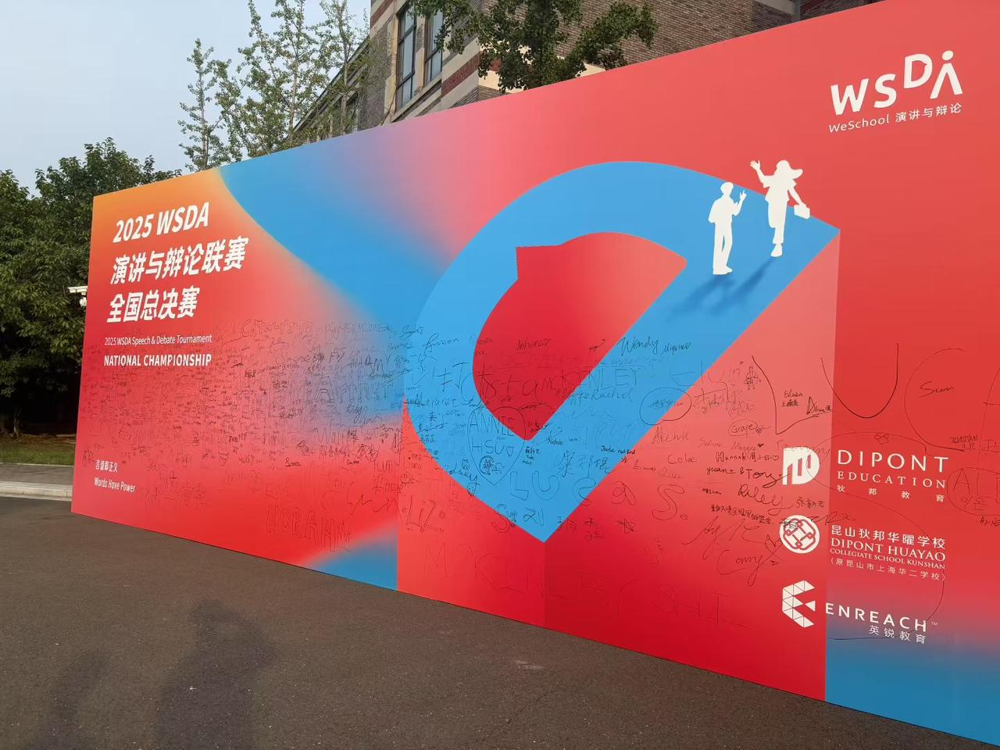

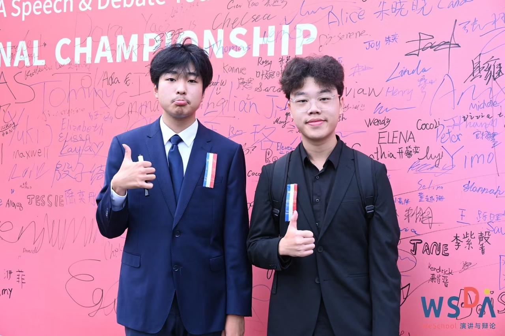

e-china:

[黄玄麟 e-china 复赛.MOV](<files/黄玄麟 e-china 复赛.MOV>)

### c. 媒体呈现需求：

同时呈现

## 4. 活动/项目名称：Other Speaking Opportunities

### b. 相关媒体呈现：

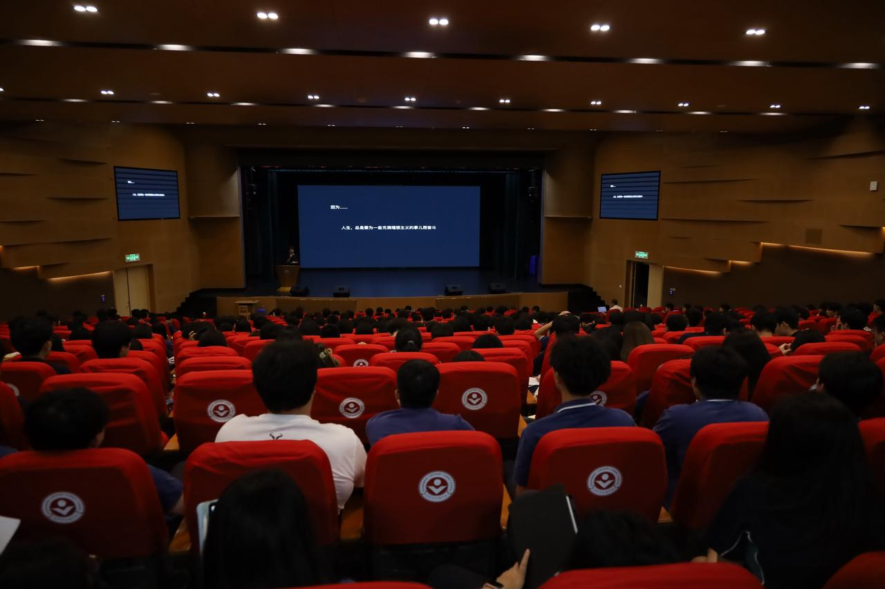

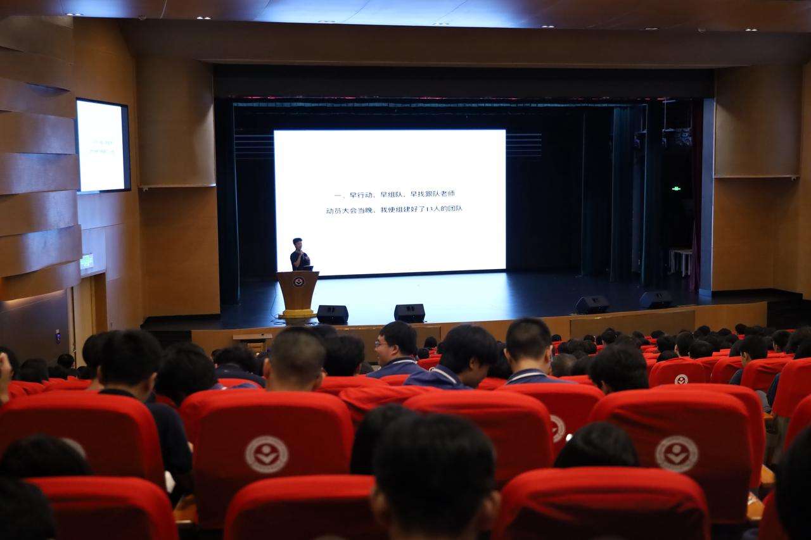

### c. 媒体呈现需求：

同时呈现
